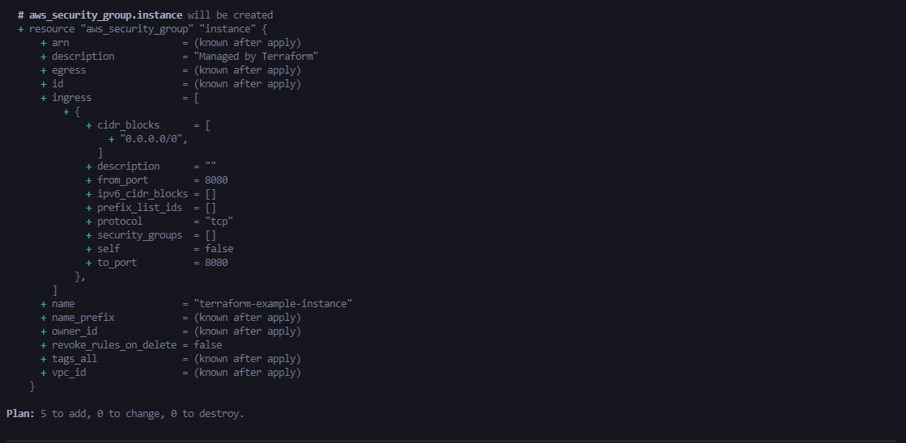

## **Task 1 :** Automate EC2 instance Creation using Terraform on AWS Cloud

- Using terraform to create infrastrucutre on AWS
- I Deploy a single instance on AWS using the items below:

1. VPC

2. Subnet inside VPC

3. Internet gateway associated with VPC

4. Route Table inside VPC with a route that directs internet-bound traffic to the internet gateway

5. Route table association with our subnet to make it a public subnet

6. Security group inside VPC

7. Key pair used for SSH access

8. EC2 instance inside our public subnet with an associated security group and generated a key pair

Using terraform I setup an immutable infrastructure which can be destroyed and created using single command.

### **Commands used :**

terraform init : Initialize a Terraform working directory

terraform plan : Generate and show an execution plan

terraform apply : Builds or changes infrastructure

terraform destroy : Destroy Terraform-managed infrastructure.

Variables are read from variables.tf file. If not specified in that file, parameters are read from following places :

1. Command line flags

2. File named terraform.tfvars, if name is something else can be provided using command line flag

3. Environment variables

4. UI input (only supports String variables)

**Screenshot of terraform plan**


**Screenshot of terraform apply**


**Screenshot of running instance**


## **Task 2 :** Automate multiple EC2 instances Creation using Terraform on AWS Cloud

To create multiple ec2 instance in AWS account using terraform code you can edit the variables file.

```javascript
  variable "instance_count" {
  description = "Number of instances to be created"
  default     = "1"
  type = string
}


```

**Screenshot of terraform plan**


**Screenshot of terraform apply**


**Screenshot of running instance**


## **Task 3 :** Deploy a cluster 0f 6 web servers (for high availability use auto scaling)

This folder ("webservers-clusters") is an example of using ELB Elastic Load Balancing with ASG Auto Scaling Group to provide highly available and efficient web servers

### Deploy a Cluster of Web Servers

I use ASG to launch a cluster of EC2 Instances, replacing failed Instances, and adjusting the size of the cluster in response to load.

- ASG distributes the EC2 instances across multiple availability zones
  - each AWS account has access to different set of Availability zones, in this repo, i've choosed all availability zones available in my account

### Deploy a Load Balancer

After deploying the ASG you'll have serveral different servers, each with its own ip address, but you need to give your end users only a single IP to hit, and for this I deploy a load balancer to distribute traffic accross the servers and to give your end users a single dns name which is the the load balancer dns name.


**Screenshot of terraform plan**




**Screenshot of terraform apply**


**Screenshot of running instance**


